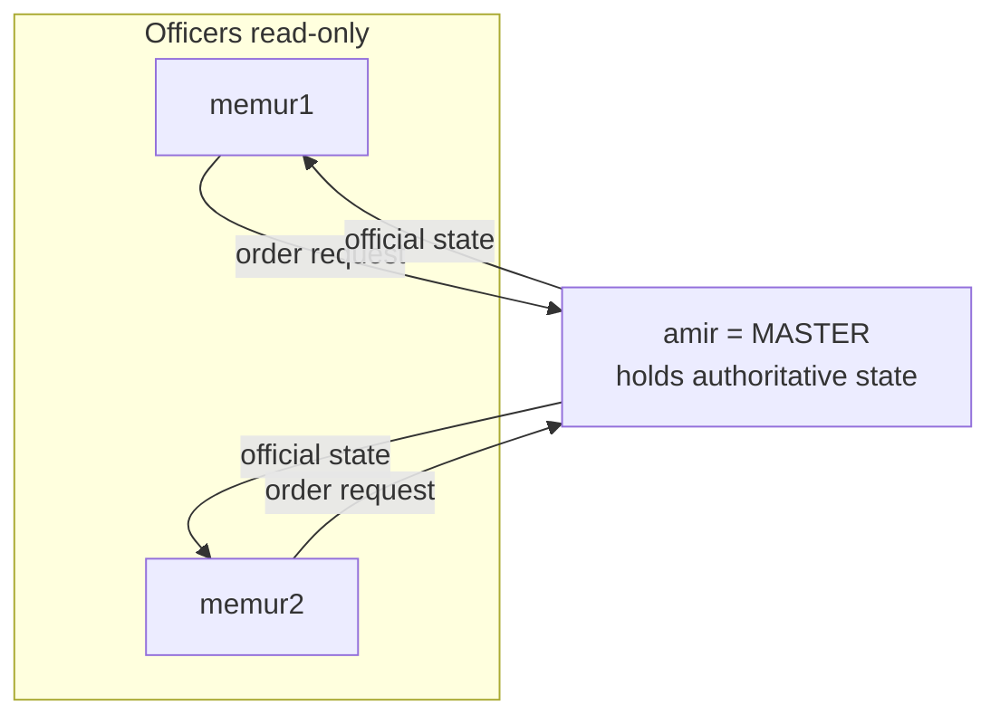
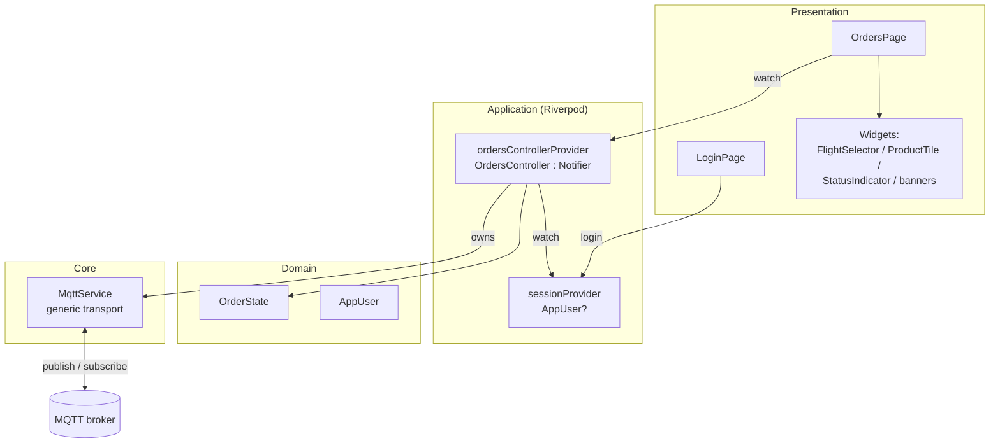
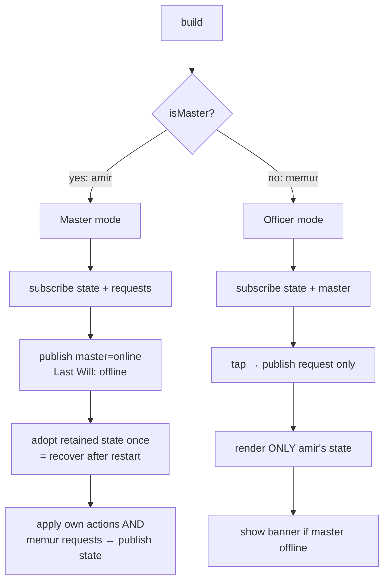
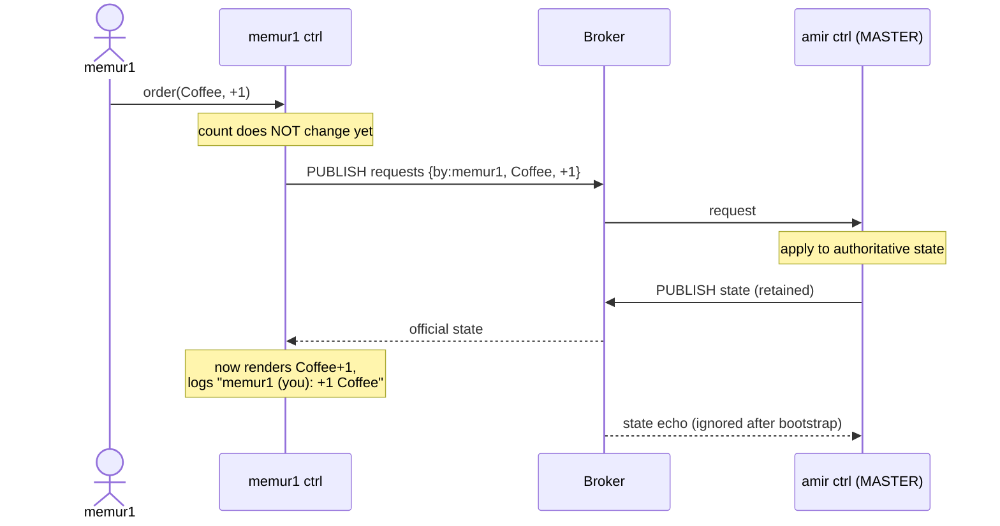
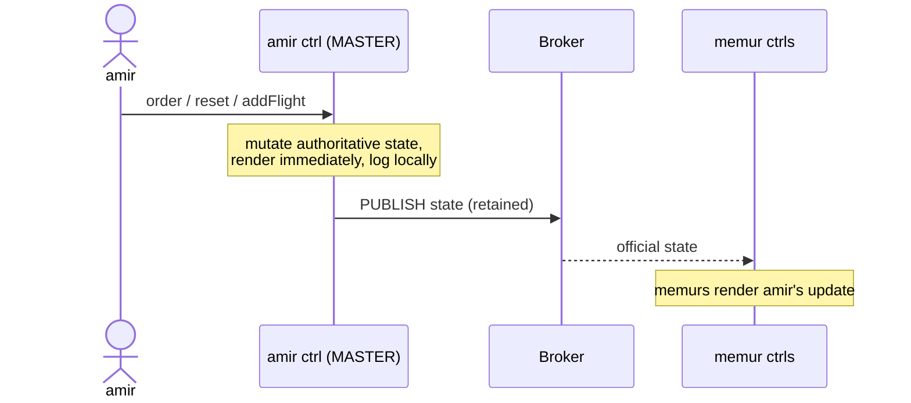
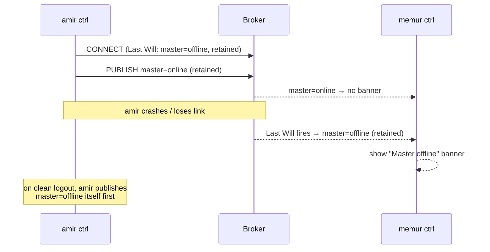
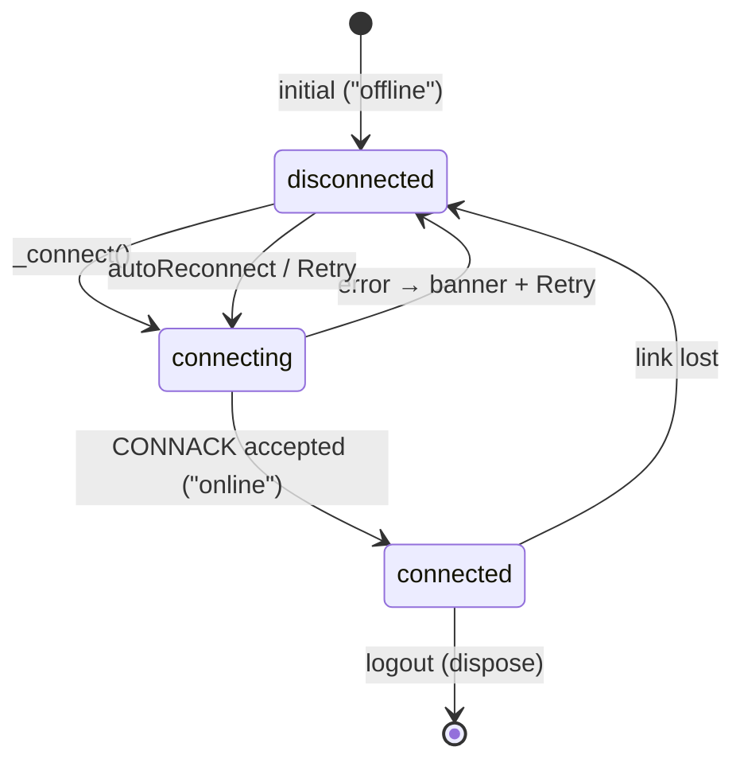
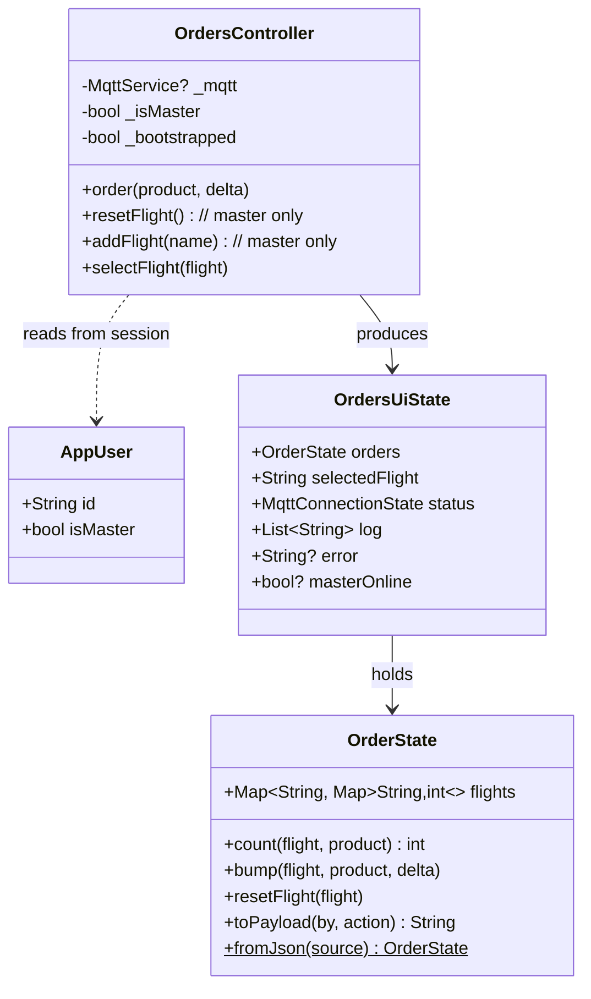

# Flight Orders — Architecture & Logic

A small Flutter app where three users — **amir**, **memur1**, **memur2** — place
catering orders (Coffee / Sandwich / Water) against flights (e.g. `TK1234`).

**amir is the master and the single source of truth.** Officers (memur1,
memur2) don't change data directly — they send *order requests* to amir, who
applies them and publishes the official state that everyone renders.

- **Broker:** `173.249.32.141:1883` (TCP), auth `app` / `changeme`
- **Transport package:** `mqtt_client` (`MqttServerClient`, raw TCP)
- **State management:** Riverpod 3 (`Notifier`)

---

## 1. The core idea: one writer, many readers



- Only **amir** ever writes the official state.
- Officers **never** mutate their own counts. A tap sends a request and the
  number changes only when amir's state comes back (**strict** source of truth).
- amir applies **his own** actions and **officers' requests** through the same
  path, so there is exactly one place where state changes.

---

## 2. MQTT topics

| Topic | Published by | Subscribed by | Retained | Purpose |
|-------|--------------|---------------|----------|---------|
| `flightorders/state` | **amir only** | everyone | ✅ yes | The official orders everyone renders |
| `flightorders/requests` | memur1, memur2 | **amir only** | ❌ no | Order requests sent to the master |
| `flightorders/master` | amir | memurs | ✅ yes | Presence: `online` / `offline` |

Why **retained** on `state` and `master`: the broker keeps the last message, so
a user (or the master after a restart) who connects later immediately gets the
current orders and the current master presence — no replay logic needed.

### Payloads

**Official state** (`flightorders/state`) — the full state plus the action that
produced it (used for the activity log):

```json
{
  "flights": { "TK1234": { "Coffee": 2, "Sandwich": 0, "Water": 1 } },
  "lastAction": { "by": "memur1", "text": "+1 Coffee on TK1234" }
}
```

**Order request** (`flightorders/requests`):

```json
{ "by": "memur1", "flight": "TK1234", "product": "Coffee", "delta": 1 }
```

**Presence** (`flightorders/master`): the literal string `online` or `offline`.

---

## 3. Layered structure

Feature-first; each layer talks to the next through a narrow interface.



| Layer | File | Responsibility |
|-------|------|----------------|
| Presentation | `features/auth/presentation/login_page.dart` | Pick a user, set session, navigate |
| Presentation | `features/orders/presentation/orders_page.dart` | Render orders/activity, fire actions, banners |
| Application | `features/auth/application/session.dart` | Who is logged in (`AppUser?`) |
| Application | `features/orders/application/orders_controller.dart` | Role logic, connection, UI state |
| Domain | `features/orders/domain/order_state.dart` | Shared data + JSON (de)serialisation |
| Core | `core/mqtt/mqtt_service.dart` | Connect (+ Last Will), publish, message stream |

`MqttService` is intentionally app-agnostic: `connect({subscriptions, will})`,
`publish(topic, payload, {retain})`, and a `messages` stream of
`BrokerMessage(topic, payload)`. All topic meaning lives in the controller.

---

## 4. Roles inside `OrdersController`



Flight management — **Add flight** and **Reset** — is **master-only**, since
officers can't create state amir hasn't sanctioned.

---

## 5. Officer places an order (strict source of truth)



If amir is **offline**, the request is simply not delivered (clean session, not
retained) — memur1's count stays put and the **"Master offline"** banner is
shown, so the lost order is obvious.

---

## 6. amir places an order / manages flights



amir renders his own change immediately (he *is* the truth) and logs locally.
He does **not** re-process his own state echoes (guarded by a `bootstrapped`
flag), so there's no double-logging.

---

## 7. Master presence (Last Will)



`masterOnline` is tri-state: `null` (unknown — no banner), `true`, `false`. The
banner shows only when an officer has positively learned the master is offline.

---

## 8. Connection lifecycle



> **Implementation note:** the connect is started with `Future.microtask(_connect)`
> from `build()`. Riverpod forbids touching `state` during `build()`, and the
> connect updates status — running it inline caused a *"Tried to read the state
> of an uninitialized provider"* crash (which presented as "stuck offline" /
> frozen-after-login). Deferring one microtask fixes it.

---

## 9. Data model



---

## 10. Trade-offs of the master model

- **Pro:** one writer → no write conflicts; amir has real authority; presence
  makes connectivity explicit.
- **Con:** amir is a single point of failure. While amir is offline, officers
  can't change anything (by design). This is the deliberate cost of "amir is the
  source of truth", and it's why a peer model would be preferable if we later
  add long-range **Bluetooth mesh** (no single hub to route through).

---

## Appendix — verifying the broker topology

`tool/connectivity_check.dart` exercises all three topics against the live
broker (presence, request routing, state delivery):

```bash
dart run tool/connectivity_check.dart
```

To wipe retained state and presence and start clean:

```bash
mosquitto_pub -h 173.249.32.141 -p 1883 -u app -P changeme -t "flightorders/state"  -r -n
mosquitto_pub -h 173.249.32.141 -p 1883 -u app -P changeme -t "flightorders/master" -r -n
```
