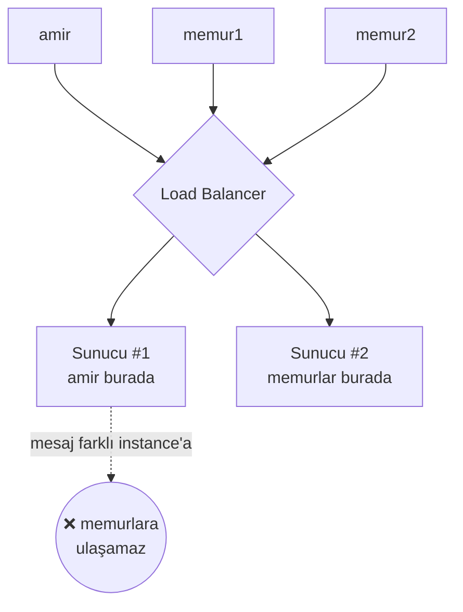
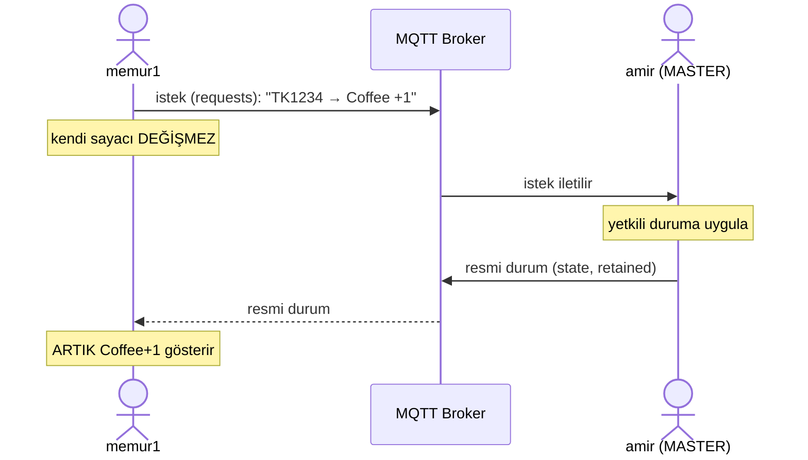

# Neden WebSocket değil de MQTT?

Bu doküman, amir ↔ memur senkronizasyonunu **neden MQTT** ile yaptığımızı, aynı
işi **WebSocket** ile yapsaydık karşılaşacağımız problemleri (özellikle
çok-sunuculu / *multi-instance* dağıtımda) ve MQTT'nin üstünlüklerini sade bir
dille anlatır.

Mimarinin ayrıntısı (topic'ler, payload'lar, master modeli) için bkz.
[`architecture.md`](./architecture.md).

---

## 1. Temel fark

WebSocket, TCP üzerinde çift yönlü ve kalıcı bir bağlantı sağlayan bir **taşıma
katmanı protokolüdür** (OSI L7'de oturur ama uygulama semantiği taşımaz). Bayt/
mesaj çerçevelerini iletir; bunların *anlamını*, *kime gideceğini* ve *durumun
nasıl saklanacağını* tanımlamaz.

MQTT ise bu taşıma üstüne **broker tabanlı publish/subscribe**, **son-durum
saklama (retained)**, **çevrimdışı tespiti (Last Will & Testament)** ve **teslim
garantisi (QoS 0/1/2)** ekleyen tam bir **mesajlaşma protokolüdür**. WebSocket ile
çalışsaydık bu yeteneklerin hepsini uygulama/sunucu katmanında **kendimiz
gerçeklemek** zorunda kalırdık — ve dağıtık ortamda doğru kurmak zordur.

---

## 2. WebSocket ile çıkacak problemler

### 2.1 Multi-instance (çok-sunuculu) fan-out problemi

WebSocket bağlantısı **state'lidir**: istemci hangi sunucu kopyasına (instance)
bağlandıysa, soket **sadece o instance'ın belleğinde** durur. amir Instance-A'ya,
memur Instance-B'ye bağlıysa, A'ya gelen mesaj B'deki memur'a **kendiliğinden
ulaşmaz.**

İstemci sayısı tek sunucuyu aşıp **2. instance** açtığınız an senkronizasyon
bozulur. Çözmek için ek altyapı şarttır (Redis/NATS gibi bir "backplane" veya
herkesi aynı sunucuya sabitleyen sticky-session — ki bu da ölçeklenmeyi öldürür).

MQTT'de **broker zaten merkezi noktadır** — bu sorun en baştan yoktur.

### 2.2 Geç bağlanan istemci son durumu bilmez

WebSocket yalnızca **bağlı olduğun andan sonra** akan mesajları görür. Memur
uygulamayı sonradan açarsa veya bağlantısı koparsa, kaçırdığı son durumu göremez.
`architecture.md`'de bu MQTT'de **retained mesaj** ile çözülüyor: broker
`flightorders/state`'in son halini tutar, geç bağlanan herkes anında güncel
siparişleri alır — "replay" kodu yazmaya gerek kalmaz.

### 2.3 "Amir çevrimdışı oldu mu?" bilgisini taşımaz

amir çökerse, memur'un bunu anında öğrenip **"Master offline"** uyarısını
göstermesi gerekir (bkz. `architecture.md` §7). WebSocket'te bunu heartbeat +
timeout ile elle kurmalısın. MQTT'de **Last Will & Testament** vardır: amir
bağlanırken "kopnarsam şunu yayınla" der, broker kopmayı görünce
`master=offline`'ı otomatik gönderir.

### 2.4 Teslim garantisi yok

WebSocket "gönder ve unut"tur; mesajın ulaşıp ulaşmadığını garanti etmez. MQTT'de
**QoS** seviyeleri ile teslim güvencesi seçilebilir.

---

## 3. WebSocket vs MQTT — karşılaştırma

| Konu | WebSocket (çıplak) | MQTT |
|------|--------------------|------|
| Katman | Sadece taşıma | Tam mesajlaşma protokolü |
| Multi-instance fan-out | ❌ Manuel backplane (Redis/NATS) gerekir | ✅ Broker doğal merkez |
| Geç bağlanan son durumu alır mı | ❌ Elle "replay" yazılır | ✅ Retained mesaj |
| Çevrimdışı tespiti | ❌ Elle heartbeat/timeout | ✅ Last Will |
| Teslim garantisi | ❌ Yok | ✅ QoS |
| Yönlendirme | Sunucu kodu yazar | ✅ Topic + abonelik |

> Not: MQTT, tarayıcıda **WebSocket üzerinden** de çalışabilir (projedeki
> `wss://stagingenvironment.space/mqtt` yolu gibi). Yani seçim aslında
> "WebSocket mı MQTT mi" değil; **"çıplak WebSocket üstüne her şeyi kendim mi
> yazayım, yoksa MQTT'nin hazır broker'ını mı kullanayım"** sorusudur.

---

## 4. Sync nasıl çalışıyor? (MQTT)

`architecture.md`'deki **tek yazıcı** modelini izliyoruz: amir master'dır ve tek
gerçek kaynaktır. Memurlar veriyi **değiştirmez**, sadece *istek* gönderir; amir
uygular ve resmi durumu yayınlar.

Kim hangi topic'e neyi yolluyor / dinliyor:

| Aktör | Yayınlar (PUBLISH) | Dinler (SUBSCRIBE) | Ne yollar |
|-------|--------------------|--------------------|-----------|
| **amir** | `flightorders/state` (retained), `flightorders/master` (retained) | `flightorders/requests` | Resmi durum + online/offline |
| **memur** | `flightorders/requests` | `flightorders/state`, `flightorders/master` | "Şu uçuşa şu üründen ±1" isteği |

Memur'un sayacı, ancak amir'in resmi durumu geri geldiğinde değişir (strict source
of truth). amir çevrimdışıysa istek teslim edilmez, sayaç sabit kalır ve memur
"Master offline" uyarısını görür — kaybolan sipariş böylece belli olur.

---

## 5. Sonuç

- **WebSocket** iyi bir taşıma katmanıdır ama *sadece* taşımadır.
- amir/memur senaryosunda gereken **fan-out, son-durum (retained), çevrimdışı
  tespiti (Last Will) ve teslim garantisi (QoS)** MQTT'de hazırdır; WebSocket'te
  hepsi elle ve dağıtık ortamda kırılgan biçimde yazılır.
- Özellikle **multi-instance** ölçeklenmede WebSocket ek backplane zorunlu
  kılarken, MQTT'de **broker doğal merkezdir.**

Bu yüzden bu projede taşıma olarak **MQTT** seçilmiştir.
